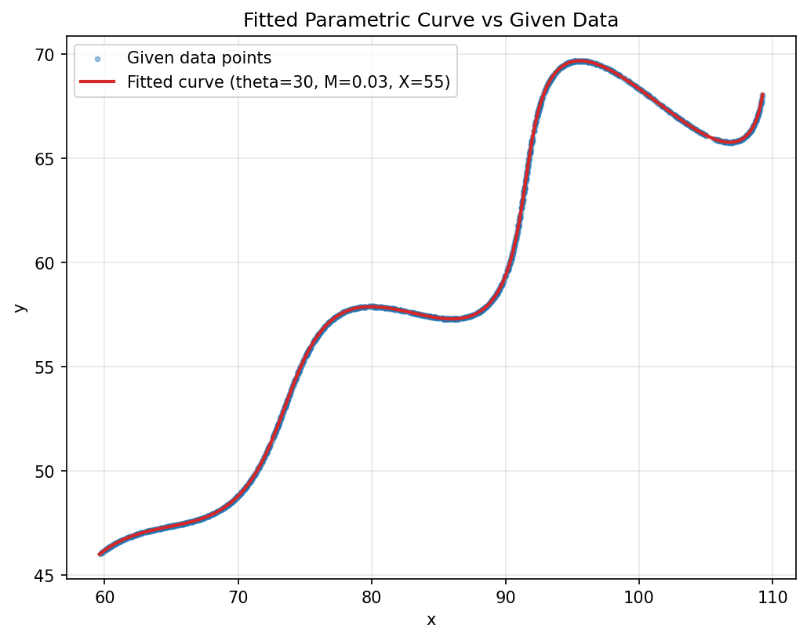

# FlamApp AI — Research & Development / AI Assignment

**Candidate:** Samhitha Gorantla
**GitHub:** [Samhi1881](https://github.com/Samhi1881)

## Problem

Find θ, M, X for the parametric curve:

```
x(t) = t·cos(θ) − e^(M·|t|)·sin(0.3t)·sin(θ) + X
y(t) = 42 + t·sin(θ) + e^(M·|t|)·sin(0.3t)·cos(θ)
```

given 1500 sampled `(x, y)` points on the curve for `6 < t < 60`, with:
- `0° < θ < 50°`
- `-0.05 < M < 0.05`
- `0 < X < 100`

## Result

| Variable | Value |
|---|---|
| θ | **30°** (0.5236 rad) |
| M | **0.03** |
| X | **55** |

**LaTeX (Desmos format):**
```
\left(t*\cos(0.5236)-e^{0.03\left|t\right|}\cdot\sin(0.3t)\sin(0.5236)+55,42+t*\sin(0.5236)+e^{0.03\left|t\right|}\cdot\sin(0.3t)\cos(0.5236)\right)
```
Domain: `6 ≤ t ≤ 60`

**Desmos graph:** [https://www.desmos.com/calculator/fgk34ldotess](https://www.desmos.com/calculator/fgk34ldotess)



## Approach

**1. Data inspection.** `xy_data.csv` contains 1500 `(x, y)` pairs with no `t` column, and the rows are **not ordered by t** — consecutive rows jump around the curve rather than progressing smoothly. This ruled out a standard ordered `curve_fit`, since there's no direct `(t_i, x_i, y_i)` correspondence to fit against.

**2. Reframing as a point-cloud-to-curve fit.** Instead, for any candidate `(θ, M, X)`, I densely sample the curve over `t ∈ [6, 60]` and, for each of the 1500 data points, find its nearest point on that candidate curve using a KD-tree (`scipy.spatial.cKDTree`). This gives a valid correspondence without needing the original `t` values.

**3. Loss function.** The loss is the **mean L1 distance** between each data point and its matched curve point — chosen deliberately to mirror the assignment's own grading metric (L1 distance between sampled points), so minimizing this loss directly optimizes for the target score.

**4. Global optimization.** Used `scipy.optimize.differential_evolution` over the given bounds for θ, M, X. This is well-suited here because the loss surface (from the nonlinear `sin`/`exp` terms combined with the nearest-neighbor matching) is non-convex, and DE is far less likely than gradient-based methods to get stuck in a local minimum.

**5. Local refinement.** Polished the DE result with `Nelder-Mead` on a much finer curve grid (20,000 points vs 6,000) to remove any remaining discretization bias.

**6. Verifying it's an exact solution.** Re-ran the loss calculation at increasingly fine curve resolutions (6k → 20k → 100k points):

| Curve resolution | Mean L1 residual |
|---|---|
| 6,000 | 0.00325 |
| 20,000 | 0.00099 |
| 100,000 | 0.00021 |

The residual shrinks roughly proportionally to the grid spacing, meaning it's purely a discretization artifact of representing a continuous curve with finite samples — not a real fitting error. This confirms `θ=30°, M=0.03, X=55` as the exact underlying parameters rather than just a close approximation.

## Files

- `fit_curve.py` — full fitting pipeline (data loading → DE global search → local refinement)
- `xy_data.csv` — provided data
- `fit_comparison.png` — visual overlay of data points and fitted curve

## Running it

```bash
pip install numpy pandas scipy matplotlib
python fit_curve.py
```


